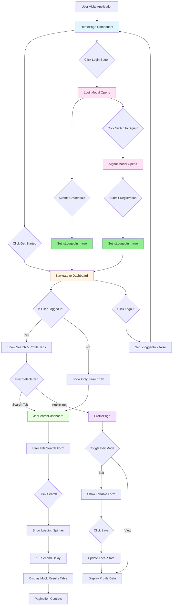
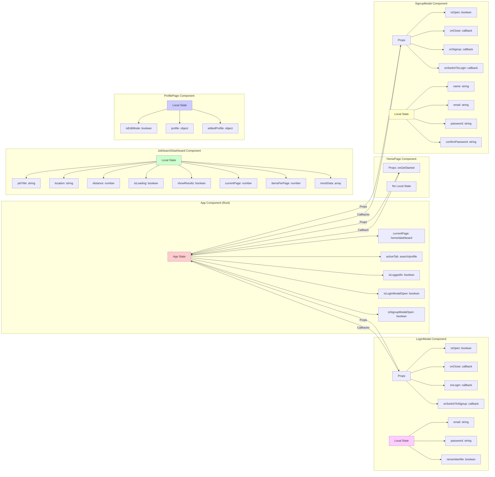
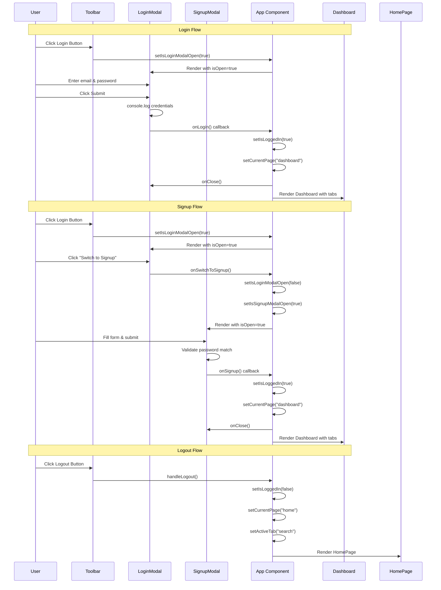
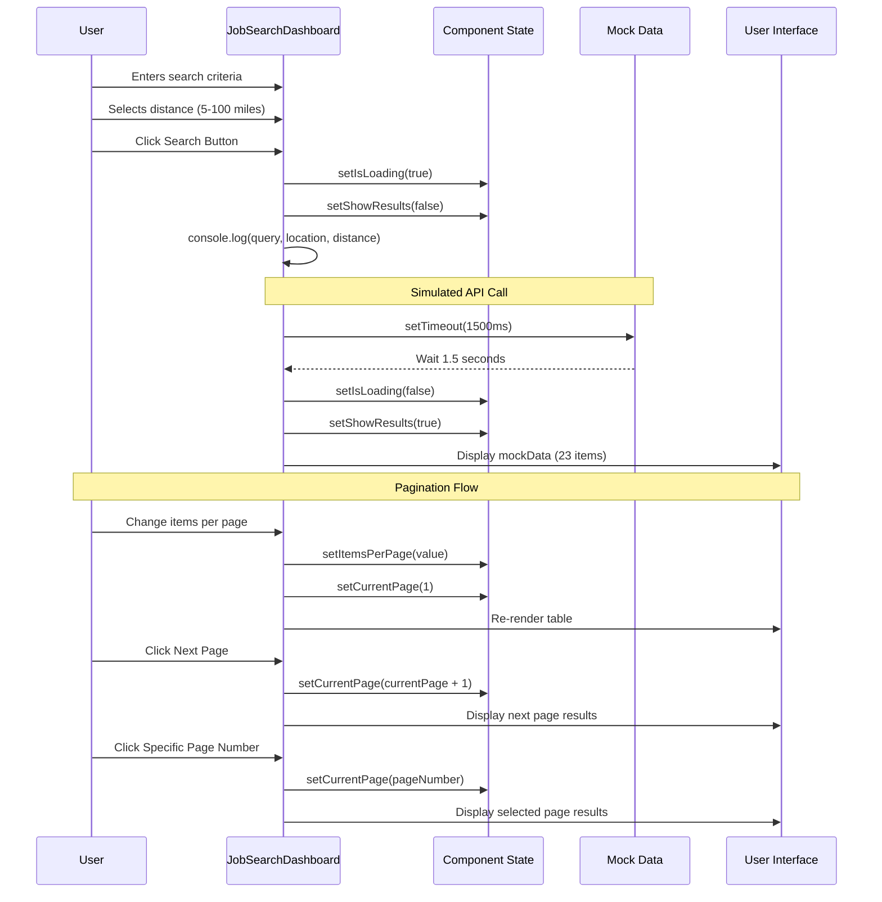
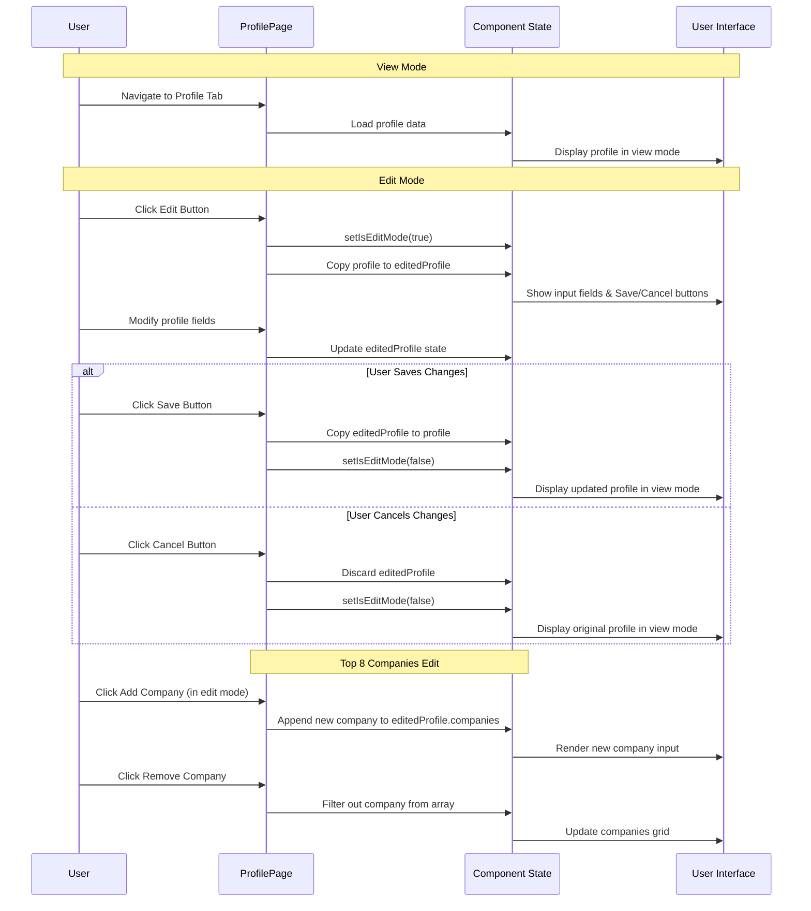
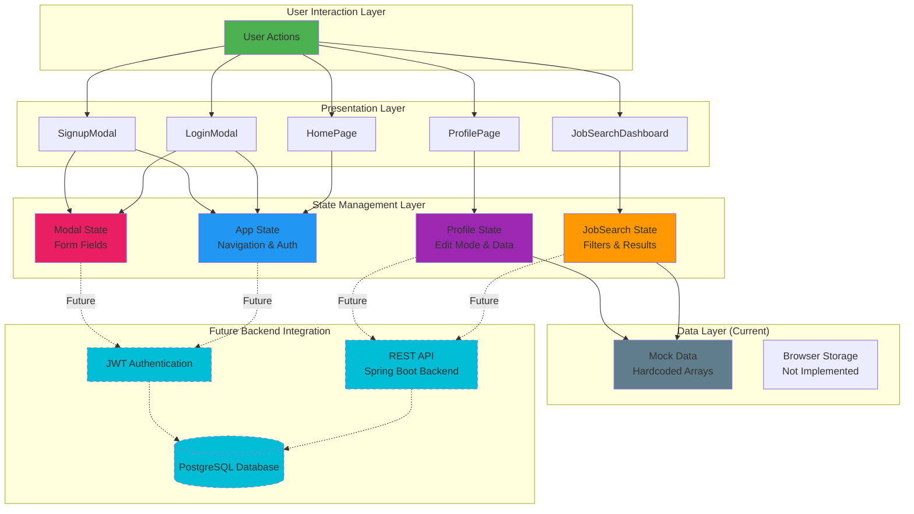
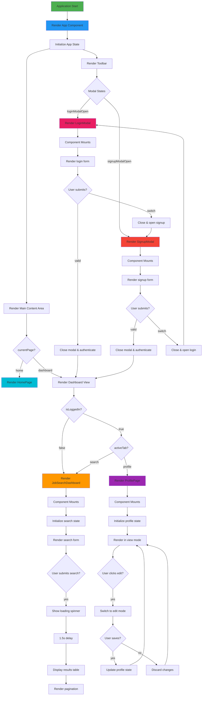
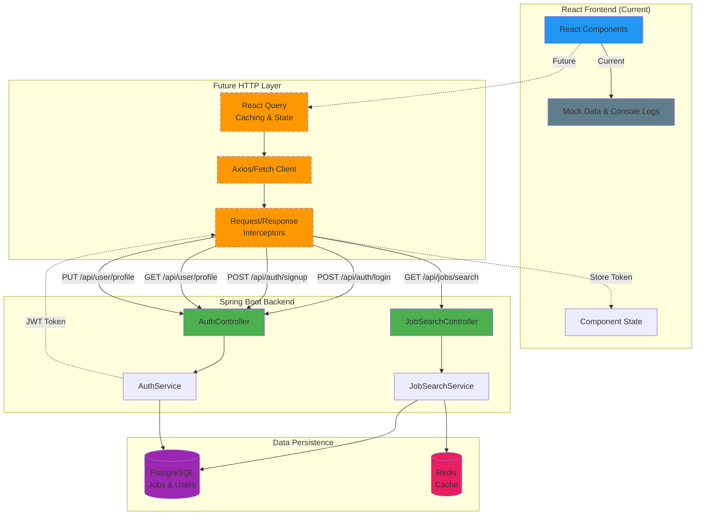

# ProjectDashbored Frontend Flow Diagram

## User Navigation Flow

## Component State Flow

## Authentication Flow

## Job Search Flow

## Profile Edit Flow

## Data Flow Architecture

## Component Lifecycle and Rendering

## Future API Integration Architecture

## Key Observations

### Current State (Mock Implementation)
1. **No Real API Calls**: All data is mocked with hardcoded arrays
2. **Console Logging**: Form submissions log to console instead of sending to backend
3. **Simulated Delays**: `setTimeout` used to mimic API latency
4. **Local State Only**: No persistence between page refreshes
5. **No Authentication**: Login/signup are visual only

### State Management Pattern
- **Unidirectional Data Flow**: Props down, callbacks up
- **Component-Level State**: Each component manages its own state
- **No Global State**: No Context API, Redux, or Zustand
- **Prop Drilling**: Limited to 2-3 levels (acceptable for current scale)

### Navigation Pattern
- **State-Based Routing**: Uses `currentPage` and `activeTab` state
- **No URL Routing**: Browser back button won't work
- **Modal Management**: Separate boolean states for each modal

### Future Integration Needs
1. **HTTP Client**: Axios or native Fetch
2. **State Management**: React Query for server state
3. **Router**: React Router for URL-based navigation
4. **Authentication**: JWT token storage and refresh
5. **Form Validation**: React Hook Form + Zod (already installed)
6. **Error Handling**: Error boundaries and toast notifications
